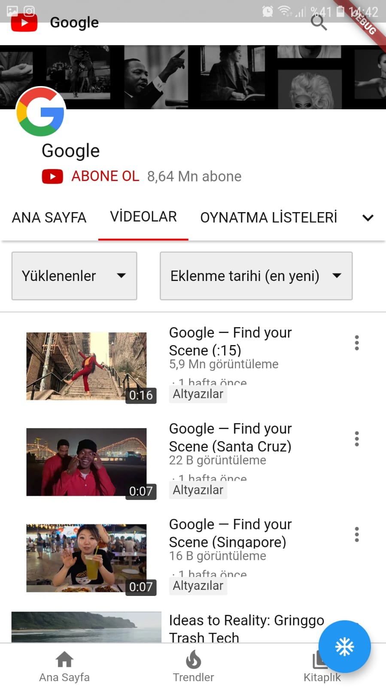

Flutter Webview Example

--ENGLISH--

" A simple WebView sample application for beginners in the 'Flutter' language. If you have an internet connection, the full screen Google homepage opens. There is a button on the bottom right of the screen.
When the button in our application is pressed, the button takes us to the Youtube page."
 good work. "
 
 
--TURKISH--

" 'Flutter' diline başlayanlar için basit bir WebView örnek uygulama. Uygulamanın açılış ekranında eğer internet bağlantınız varsa , tam ekran Google anasayfası açılıyor . Ekranın sağ alt kısımda bir adet  buton var.
Uygulamamızdaki butona basıldığında  buton bizi Youtube sayfasına yönlendiriyor.
 iyi çalışmalar. "
 

